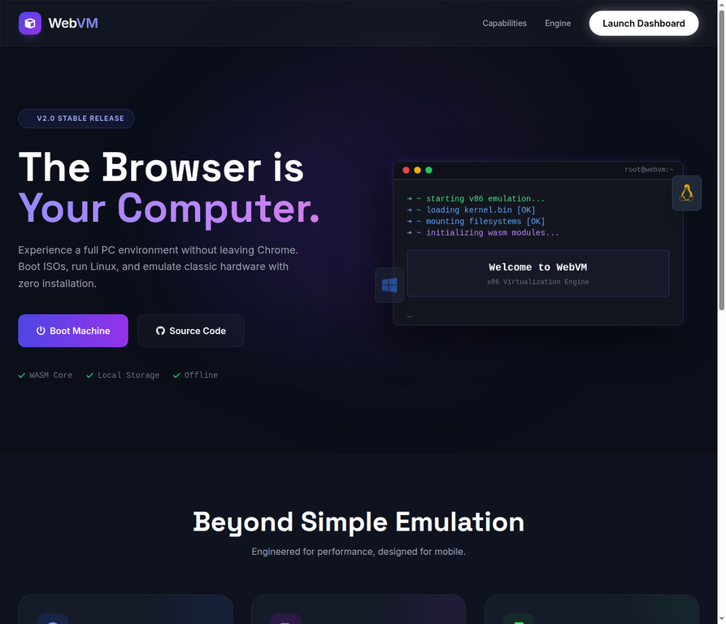
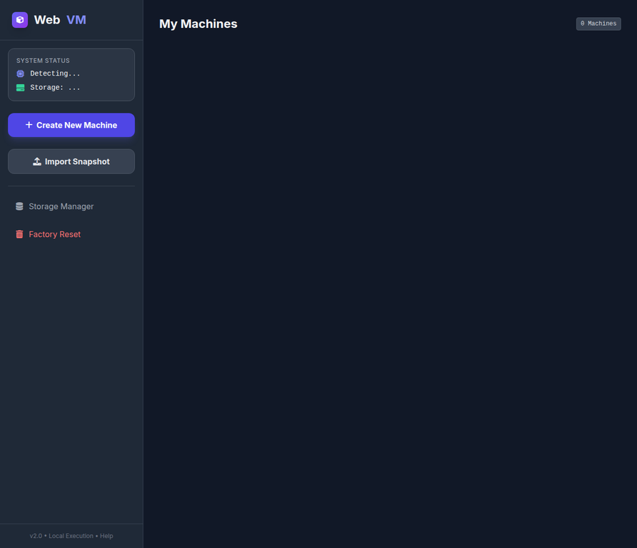
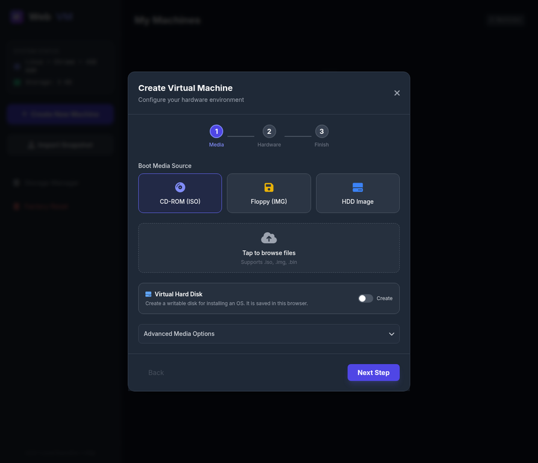
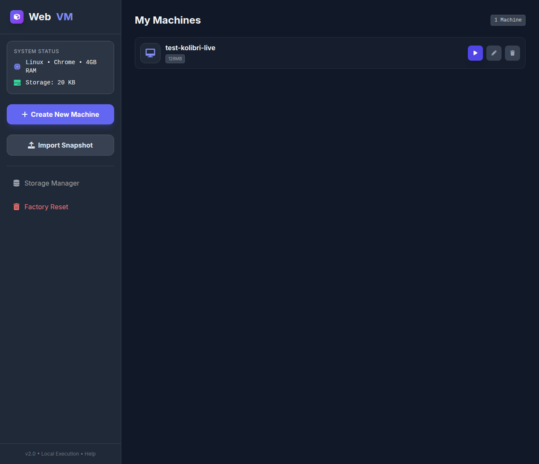
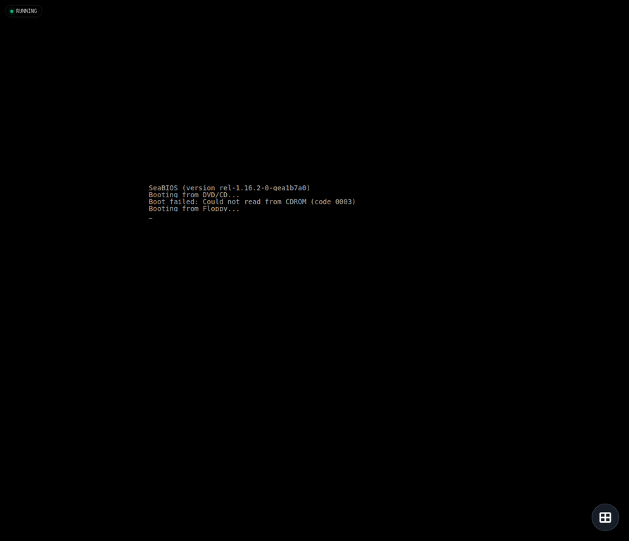
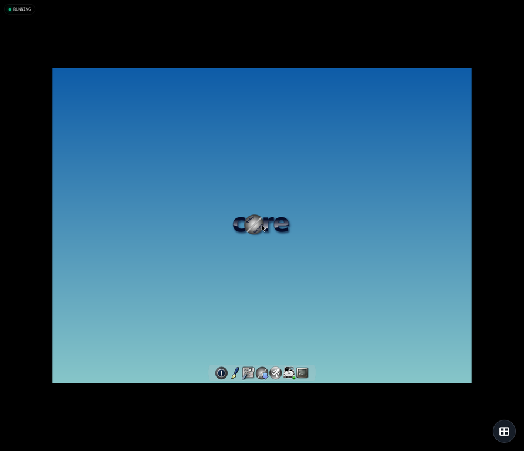
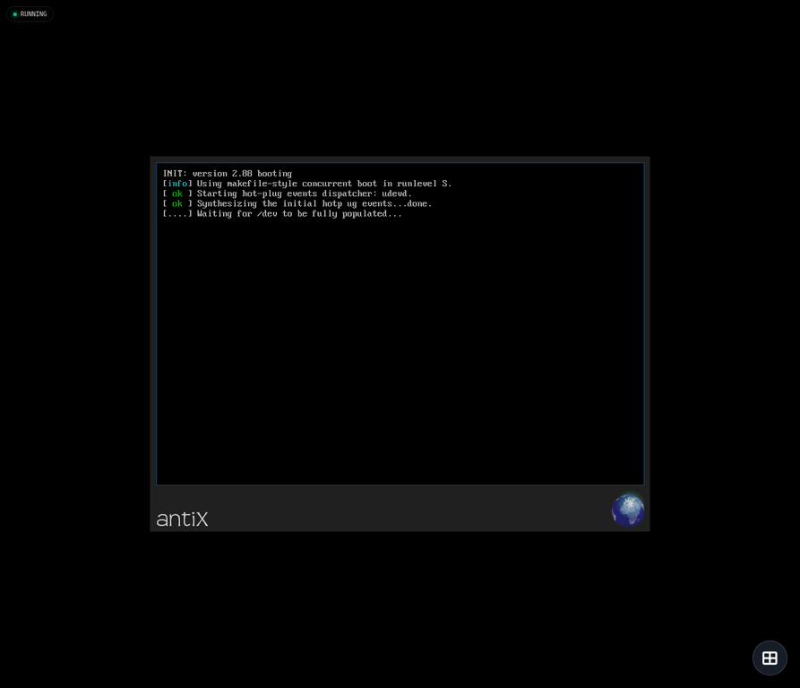
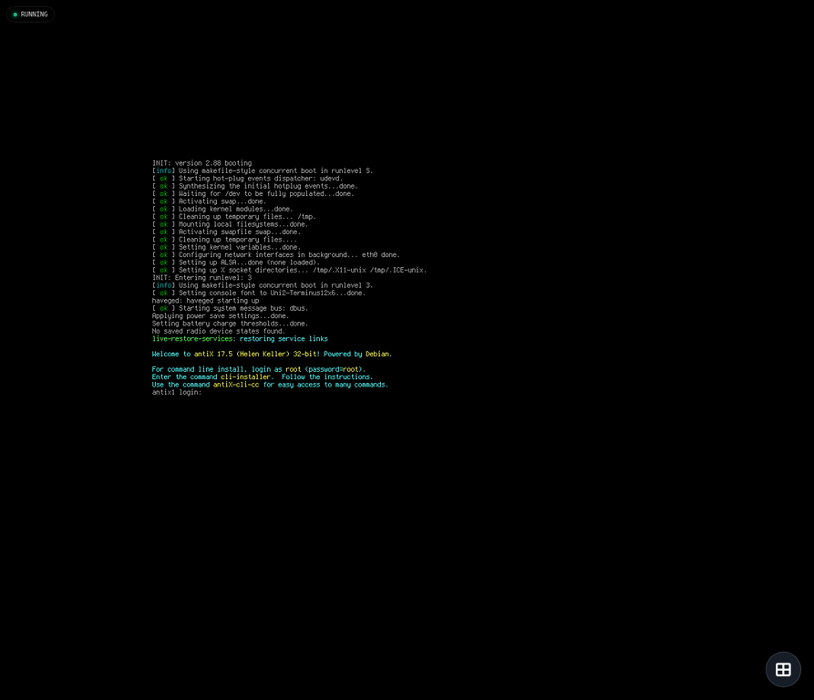
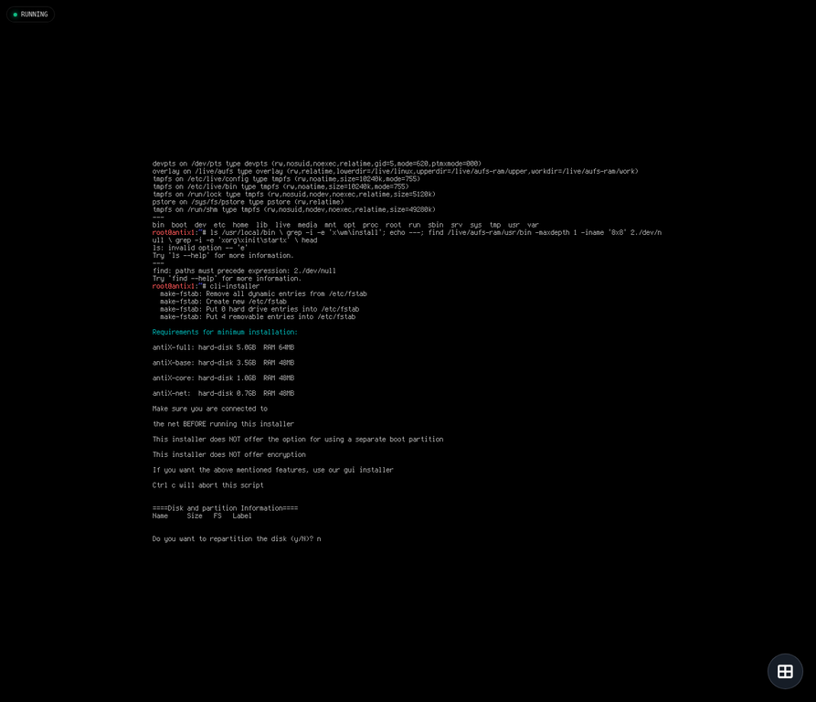
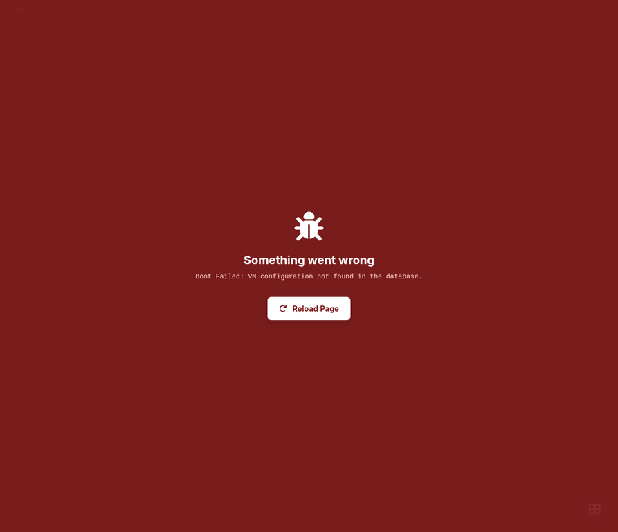

# 🖥️ Web VM Emulator v3.0

### A full x86 virtual machine running entirely in your browser — no servers, no installs.

**[🌐 Live Demo — virtual-machine.pages.dev](https://virtual-machine.pages.dev/)** ·
[GitHub Pages Mirror](https://quincunx33.github.io/Virtual-machine/)

---

## ✨ What This Is

Web VM Emulator turns any modern browser into an x86 computer. It runs **libv86** (a WebAssembly x86 emulator based on SeaBIOS) completely client-side — your VMs, snapshots, and virtual disks live in **IndexedDB** on your device. Because everything is local and event-driven, it works on **Android, iOS, Windows, and Linux** browsers with zero dependencies and zero server costs.

In this release the emulator went from "works most of the time" to **production-hardened**: crashes that previously killed tabs now show helpful error screens, assistive-touch buttons no longer get clipped at screen edges, VM deletion leaves no orphan data, RAM is actually released when you close a VM, and the app now detects your device and caps RAM automatically so low-end phones cannot crash themselves.

---

## 📸 Screenshots — Real Test Results

| Stage | Screenshot |
|---|---|
| Landing page (live site) |  |
| Dashboard — My Machines |  |
| Create wizard with advanced media options |  |
| Machine list with actions |  |
| Boot — SeaBIOS on the live site |  |
| TinyCore 64 MB — full desktop booted |  |
| antiX 17.5 — live boot splash |  |
| antiX — login shell reached |  |
| antiX — CLI installer to disk |  |

### Error overlay — failures are never silent anymore

Every uncaught error (bad VM id, missing config, emulator crash) now surfaces in a red overlay with the reason and a reload button, instead of a frozen spinner:

---

## 🧩 Features

### Core Emulation
The emulator supports **bootable floppy (IMG), hard disk (raw images), CDROM (ISO), Linux kernel (bzImage + initrd + cmdline), and snapshot restore**. Virtual hard disks created in-app are **persistent and writable** — data you save inside the VM survives restarts, and snapshots preserve the full running state.

### Mobile-First UX
An iOS-style **assistive touch** floating menu gives one-tap access to fullscreen, virtual keyboard, Ctrl+Alt+Del, snapshot, and media swap. The menu is **drag-anywhere**, and its expansion logic was re-engineered so that when opened near any screen edge or corner, all six items are automatically repositioned into a safe zone — **verified at all four corners with zero clipping**.

### Storage Manager
Every VM's media, snapshots, and disk images are managed in one place. The delete flow was rewritten with a **delegated event handler, retry logic, and post-delete verification** — VMs now actually delete, and an orphan-sweep guarantees leftover configs and snapshots are cleaned on the next dashboard load.

### Edit Anything
The **Edit Configuration** modal now exposes everything: name, RAM, network, plus the full **Advanced Media Options** — floppy A/B, hard disk, bzImage, initrd, kernel command line, System BIOS, and VGA BIOS — each with attach, replace, or detach. All six flows tested and passing.

---

## 📱 Intelligent Device Detection

A new zero-dependency module (`device-detect.js`) profiles the device at load time and caps resources conservatively so no device can crash itself:

| Profile | Detection Signals | RAM Cap |
|---|---|---|
| Mobile (low-end) | Screen width, touch points, UA hints, few cores | 64 MB |
| Mobile (modern tablet) | ≥ 4 cores or iPad-class UA | 128 MB |
| Desktop (laptop, typical) | Mouse + large viewport | 128 MB |
| Desktop (high-end) | ≥ 8 cores | 256 MB |

Detection was verified against **18 simulated device/browser profiles — all passing**, covering Android Chrome/Firefox, iOS Safari, iPadOS, Windows Chrome/Edge, and Linux Firefox/Chromium. The RAM slider in the wizard is hard-capped per profile, and creating or editing a VM above the safe limit triggers an explicit warning confirmation.

---

## 🛠️ Tech Stack

| Layer | Technology |
|---|---|
| x86 emulation | [libv86](https://github.com/copy/v86) (WebAssembly + SeaBIOS) |
| Frontend | Vanilla JS (ES6+), HTML5 — **zero build step, zero dependencies** |
| Styling | Tailwind CSS (CDN) |
| Storage | IndexedDB (vm_configs, vm_snapshots, db_metadata) |
| Cross-tab sync | BroadcastChannel API (`webvm_channel`) |
| Hosting | Cloudflare Pages + GitHub Pages mirror |

---

## 🚀 How to Use

1. **Open the app** at [virtual-machine.pages.dev](https://virtual-machine.pages.dev/) (or `text.html` if self-hosted).
2. **Create New Machine** — pick boot media (ISO, floppy, or disk), upload the image, set a name and RAM (the slider auto-caps for your device).
3. **Start** — the VM opens in a new window. Use the floating assistive button for keyboard, fullscreen, snapshots, and Ctrl+Alt+Del.
4. **Edit** any VM later — including advanced media (BIOS files, kernel boot) — from the Edit Configuration modal.
5. **Delete** via the Storage Manager — verified clean, no orphan data left behind.

### Tested boot images

| Image | Size | Result in this emulator |
|---|---|---|
| KolibriOS (floppy) | 1.5 MB | Boots to full GUI desktop ✓ |
| TinyCore Linux | 26 MB | Boots to full desktop, 64 MB RAM ✓ |
| antiX 17.5 386-core | 380 MB | Live boots to login + shell + CLI installer ✓ (install-to-disk needs ≥ 1 GB virtual disk) |
| Kali 1.1.0 386 mini | 24 MB | Bootable target for 32-bit OS testing ✓ |

---

## ⚠️ Known Limitations

**Snapshot RAM ceiling** — saving a running snapshot serializes the entire guest RAM at once. Above roughly 128 MB this can OOM-crash the tab on low-end devices, which is why the default RAM is conservative; larger devices can still snapshot 256 MB guests. **Popups** must be allowed — each VM opens in its own window for process isolation. A modern WASM-capable browser is required (Chrome 80+, Firefox 90+, Safari 15+).

---

## 🤝 Contributing & License

Fork the repo, test your changes with the bundled `test-device-detect.cjs` harness and the round-numbered cache-bust dev flow, and submit a PR.

**License:** MIT — built on the incredible work of the [v86 project](https://github.com/copy/v86).

*Web VM Emulator v3.0 · August 2026 · Real 32-bit operating systems, booted in a browser.*
