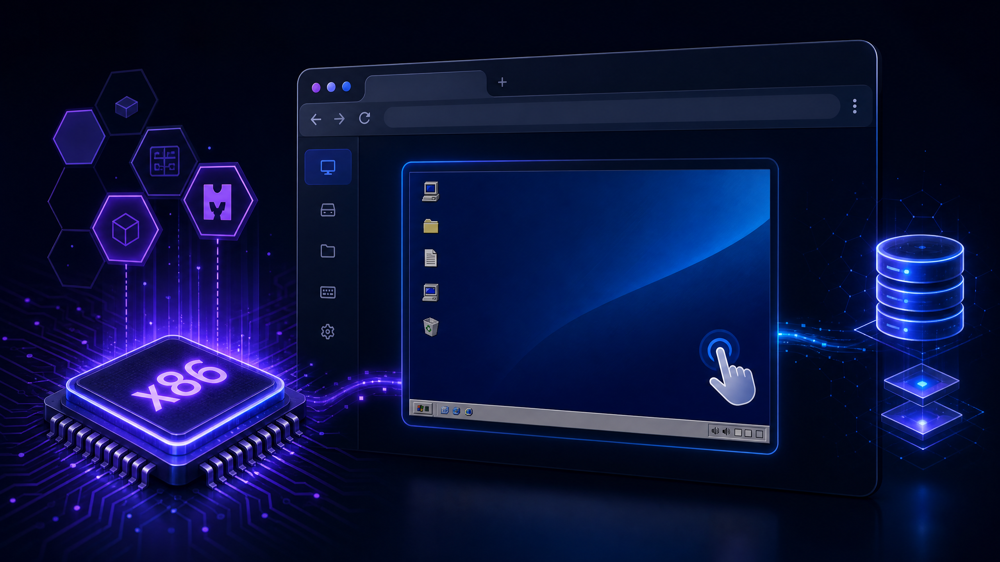
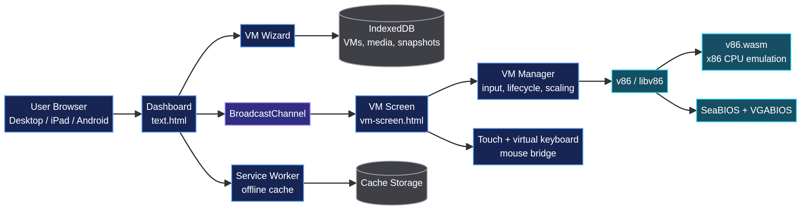

<p align="center">
  
</p>

<h1 align="center">Web VM Emulator</h1>

<p align="center">
  <strong>Run x86 operating systems directly in a modern browser.</strong><br />
  A mobile-first virtual machine workspace powered by v86, WebAssembly, IndexedDB, and touch-friendly controls.
</p>

<p align="center">
  <a href="https://github.com/Quincunx33/Virtual-machine"></a>
  <a href="https://github.com/copy/v86"></a>
  <a href="https://developer.mozilla.org/en-US/docs/Web/API/IndexedDB_API"></a>
  <a href="https://github.com/Quincunx33/Virtual-machine/blob/main/LICENSE"></a>
</p>

<p align="center">
  <a href="https://virtual-machine.pages.dev/">Live Demo</a> ·
  <a href="#quick-start">Quick Start</a> ·
  <a href="#features">Features</a> ·
  <a href="#architecture">Architecture</a> ·
  <a href="#troubleshooting">Troubleshooting</a>
</p>

> Web VM Emulator turns a browser tab into a portable x86 workstation. Upload boot media, configure a machine, and interact with the guest OS without installing a native hypervisor.

## Why this project

Traditional emulators often assume a desktop environment, local installation, and a physical keyboard. Web VM Emulator is designed around a different experience: a responsive browser interface that works across desktop and touch devices, keeps machine data in the browser, and exposes the controls needed to operate a guest OS from an iPad or phone.

The project is intentionally client-side. The emulator runs in the browser through WebAssembly, while IndexedDB stores large media files, virtual disks, machine settings, and snapshots locally. No guest-operating-system data needs to be uploaded to a central application server.

## Features

| Capability | What it provides |
|---|---|
| **x86 emulation** | Runs legacy and lightweight x86 operating systems through v86 and WebAssembly. |
| **ISO and IMG media** | Boot from CD-ROM images and floppy/disk images through the creation wizard. |
| **Virtual hard disks** | Create browser-backed virtual disks for persistent guest storage. |
| **Touch-first controls** | iPad/Android-friendly assistive controls, touch-to-mouse input, and a virtual keyboard. |
| **Mouse coordinate mapping** | Maps guest pointer coordinates to the actual emulator canvas rather than the full page container. |
| **Local persistence** | Stores VM configurations, uploaded media, snapshots, and disk data with IndexedDB. |
| **Offline caching** | Service-worker support for caching the application shell and core emulator assets. |
| **Snapshot workflow** | Save and import VM state files for repeatable experiments. |
| **Responsive interface** | Dashboard and VM controls adapt to desktop, tablet, and mobile layouts. |
| **Lifecycle controls** | Start, pause, reset, stop, fullscreen, keyboard, and Ctrl+Alt+Del actions. |

## Quick start

### Use the hosted application

Open the [Web VM Emulator live demo](https://virtual-machine.pages.dev/) in a modern browser. Allow pop-ups for the site because each running VM opens in its own screen view for better isolation and performance.

1. Select **Create New Machine**.
2. Choose **CD-ROM / ISO** or **Floppy / IMG**.
3. Upload a bootable image, such as a lightweight Linux ISO or a bootable DOS image.
4. Choose memory, boot order, and optional virtual storage.
5. Create the machine and press **Start**.
6. On touch devices, open the floating controls to use the virtual keyboard and VM actions.

### Run locally

This repository is a static browser application. A local HTTP server is recommended because WebAssembly, service workers, and browser storage behave more consistently over HTTP than over a `file://` URL.

```bash
git clone https://github.com/Quincunx33/Virtual-machine.git
cd Virtual-machine

# Any static server works. For example:
python3 -m http.server 8080
```

Then open:

```text
http://localhost:8080/text.html
```

The repository also contains Vite metadata for development workflows. If you use the package scripts, install the project dependencies first and run `npm run dev`.

## Architecture

The application is split into a dashboard, a dedicated VM screen, a storage layer, and the v86 runtime. The dashboard creates and persists machine definitions; the VM screen owns the emulator lifecycle and input bridge; BroadcastChannel coordinates state between views; and the service worker manages the application cache.

<p align="center">
  
</p>

### Main components

| Component | Responsibility |
|---|---|
| `text.html` | Dashboard, machine list, creation wizard, storage manager, and global controls. |
| `dashboard.js` | VM creation, IndexedDB operations, snapshots, storage management, and dashboard interactions. |
| `vm-screen.html` | Dedicated guest display and VM control surface. |
| `vm-manager.js` | v86 initialization, lifecycle management, canvas sizing, keyboard, touch, and mouse input. |
| `libv86.js` | JavaScript v86 runtime and browser adapters. |
| `v86.wasm` | WebAssembly x86 emulation engine. |
| `seabios.bin` / `vgabios.bin` | Firmware assets used during guest boot. |
| `sw.js` | Application-shell and emulator-asset caching. |

## Input model

The VM screen uses the emulator canvas as the source of truth for pointer coordinates. The screen container is fitted to the rendered canvas so that browser coordinates and guest coordinates remain aligned after scaling. On touch devices, tap gestures are translated into guest mouse events, while the virtual keyboard sends keyboard events to the active emulator.

For the best touch experience, open the VM in Safari on iPadOS or Chrome on Android, use landscape orientation for wide guest desktops, and keep the browser zoom at 100%.

## Browser compatibility

| Platform | Recommended browser | Notes |
|---|---|---|
| iPadOS / iOS | Safari 15+ | WebAssembly and IndexedDB are required; allow pop-ups for VM screens. |
| Android | Chrome or Chromium-based browser | Touch controls and virtual keyboard are supported. |
| Windows | Chrome, Edge, or Firefox | Desktop keyboard and pointer input are recommended. |
| Linux | Firefox or Chromium | Use a local HTTP server for development. |
| macOS | Safari, Chrome, or Firefox | Hardware acceleration can improve rendering performance. |

The emulator is resource-intensive. Lightweight guest operating systems and moderate memory allocations generally provide the best experience on mobile hardware.

## Storage and privacy

Machine configurations, uploaded media, virtual disks, and snapshots are stored in the browser's IndexedDB storage for the current origin. The service worker stores only application resources and emulator assets in Cache Storage. Turning **Offline Caching** off unregisters the service worker and removes cached application resources; it does not intentionally remove VM records, virtual disks, uploaded media, or snapshots from IndexedDB.

Use **Factory Reset** only when you intentionally want to clear application data. Browser privacy settings, private browsing modes, storage quotas, and operating-system cleanup policies can still remove local data outside the application's control.

## Troubleshooting

### The VM does not open after pressing Start

Allow pop-ups for the host, then start the VM again. The dashboard opens the running emulator in a separate screen view.

### The guest shows a blank screen or does not boot

Confirm that the selected ISO or IMG is genuinely bootable, that the boot order prioritizes the correct device, and that the allocated memory is appropriate for the guest. Very large modern operating systems may exceed the practical limits of browser emulation.

### The mouse is offset or clicks the wrong location

Reload the latest application shell after a release so that the service worker cannot serve an old engine bundle. Confirm that browser zoom is 100% and that the VM canvas is fully visible. The current VM manager maps pointer coordinates against the fitted canvas container.

### The iPad keyboard covers the guest

Use the VM screen's virtual keyboard control and rotate to landscape for wide guests. The interface includes safe-area and dynamic-viewport handling, but individual guest resolutions can still require scrolling or a different orientation.

### Offline mode appears disabled

Enable the **Offline Caching** switch from the dashboard and reload once. If the browser blocks service workers, use HTTPS or a local HTTP development server rather than opening the page directly from the filesystem.

## Development notes

The project is intentionally lightweight and uses browser-native APIs rather than a large application framework. Keep emulator lifecycle cleanup explicit: event listeners, BroadcastChannel instances, canvas resources, and large ArrayBuffers should be released when a VM is stopped or closed.

When changing `libv86.js`, `v86.wasm`, BIOS assets, or service-worker behavior, bump the cache identifier in `sw.js` and test both a clean browser profile and an existing profile with an older cache.

## Contributing

Improvements are welcome. Please keep pull requests focused, explain how the change was tested on desktop and touch layouts, and avoid committing guest media files or private snapshots. For emulator changes, include the browser versions and guest image used during verification.

## License and attribution

This project is released under the MIT License. The x86 emulation layer is based on the open-source [v86 project](https://github.com/copy/v86), and the browser storage and service-worker behavior rely on standard web platform APIs documented by [MDN](https://developer.mozilla.org/).

## References

[1]: https://github.com/copy/v86 "v86 x86 emulator"
[2]: https://developer.mozilla.org/en-US/docs/Web/API/IndexedDB_API "MDN: IndexedDB API"
[3]: https://developer.mozilla.org/en-US/docs/Web/API/Service_Worker_API "MDN: Service Worker API"
[4]: https://developer.mozilla.org/en-US/docs/WebAssembly "MDN: WebAssembly"
[5]: https://virtual-machine.pages.dev/ "Web VM Emulator live demo"
